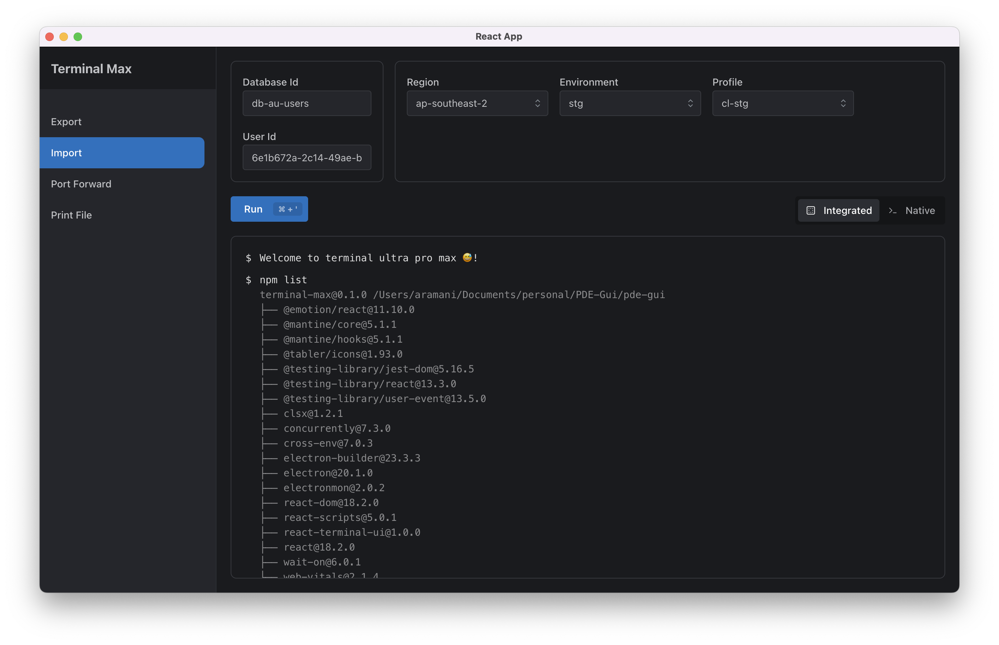

# Terminal Max 🙌

#### Terminal re-imagined - with scalability in mind.

A visual terminal can run any command with simple clicks.

### Setup
Go `public/example.command.config.json` file and remove `example.` from the file name.

`command.config.json` file is used to configure the terminal UI and controls the command execution.

### Epics Backlog
- Import config from local file
- Create custom/own command workflow
- Marketplace for publishing command configs
- Terminal UI improvements
- SSH into remote machine
- VS Code integration